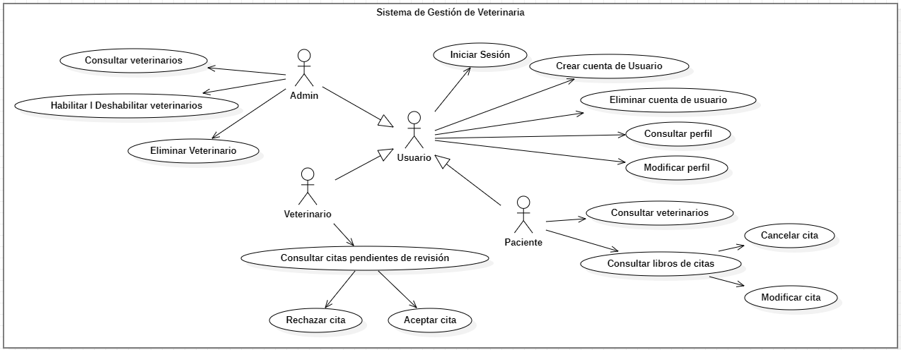

# Descripción del Sistema de Reservas para Veterinarios y Dueños de Mascotas

Este sistema tiene tres actores principales: **veterinarios**, **dueños de mascotas (pacientes)** y **administradores**. A continuación, se describe el rol de cada actor y cómo funciona el sistema.

## 1. Veterinarios

Los veterinarios son profesionales que ofrecen servicios médicos para las mascotas. Ellos pueden:

- **Crear, actualizar o eliminar su cuenta**: Los veterinarios pueden crear una cuenta, actualizar su perfil y eliminarla cuando lo deseen.
- **Recibir citas**: Cuando un dueño de mascota solicita una cita, el veterinario la recibe.
- **Aprobar o rechazar citas**: El veterinario puede aceptar o rechazar las citas enviadas por los dueños de mascotas.
- **Ver información de los pacientes**: Si la cita es aprobada, el veterinario accede a los detalles del dueño de la mascota para brindar el servicio.

## 2. Dueños de Mascotas (Pacientes)

Los dueños de mascotas son usuarios que buscan servicios veterinarios para sus animales. Sus principales acciones son:

- **Crear, actualizar o eliminar su cuenta**: Pueden gestionar su perfil en la plataforma.
- **Buscar veterinarios**: Los pacientes pueden buscar veterinarios, ver información sobre ellos (logros, valoraciones) y seleccionar uno para reservar una cita.
- **Reservar citas**: Pueden elegir fecha y hora, y enviar la solicitud de cita al veterinario.
- **Actualizar o cancelar citas**: Los pacientes pueden modificar o cancelar sus citas si es necesario.

## 3. Administrador

El administrador gestiona y supervisa a los veterinarios en el sistema. No tiene interacción directa con los dueños de mascotas, salvo que también tenga el rol de veterinario o paciente. Sus funciones incluyen:

- **Gestionar veterinarios**: El administrador puede habilitar, deshabilitar o eliminar cuentas de veterinarios que no cumplan con las normas.
- **Editar citas**: El administrador puede intervenir en la gestión de citas si es necesario.
- **Gestionar suscripciones**: Si el sistema cuenta con un modelo de suscripción, el administrador maneja los pagos y suscripciones de los veterinarios.

## Funcionamiento del Sistema

1. **Registro y gestión de cuentas**: Tanto veterinarios como dueños de mascotas pueden registrarse, crear un perfil y gestionar su cuenta.
   
2. **Búsqueda de veterinarios**: Los dueños de mascotas buscan veterinarios y pueden ver su información. Luego, seleccionan uno para reservar una cita.

3. **Reservar cita**: Los dueños de mascotas eligen una fecha y hora disponible para la cita, y envían la solicitud, que queda pendiente de aprobación.

4. **Aprobación de cita**: El veterinario recibe la solicitud de cita y puede aprobarla o rechazarla. Si se aprueba, la cita queda confirmada.

5. **Actualizar o cancelar citas**: Los dueños de mascotas pueden modificar o cancelar sus citas si es necesario. Los veterinarios también pueden modificar su disponibilidad.

6. **Gestión de veterinarios**: El administrador se encarga de supervisar y gestionar las cuentas de los veterinarios, asegurando el cumplimiento de las normas del sistema.

## Objetivo del Sistema

El objetivo principal del sistema es **conectar veterinarios con dueños de mascotas**, ofreciendo una plataforma sencilla para gestionar citas, mientras que el administrador asegura el correcto funcionamiento del sistema.

## Diagrama de Casos de uso

